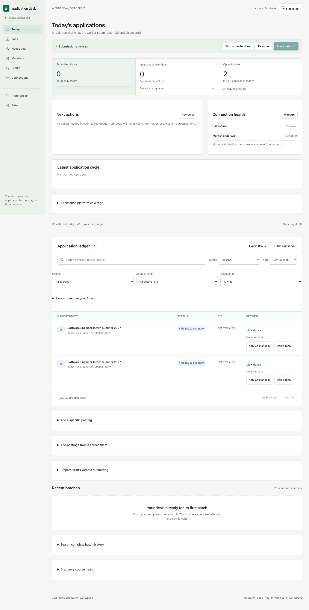

# please-hire-me

A job application desk that runs on your computer—or a Raspberry Pi—and works from **your confirmed facts and your writing**. Discover opportunities, filter them against your preferences, fill supported applications, and keep a durable record of what submitted, what needs you, and what remains uncertain.



*Read-only demo with invented companies and application records. [Try the sample workspace](#try-a-sample-workspace) without importing personal information.*

This project began as a fork of [alecswang/please-hire-me](https://github.com/alecswang/please-hire-me). The original automation and discovery work provided the starting point. This fork grew from trying to make that workflow usable day after day: watching applications fail, distinguishing missing facts from poor context matching, and replacing fragile retries with a private ledger and explicit controls. The original MIT license and attribution remain.

## What changed

- **A setup flow for each applicant:** resume, optional transcript and cover-letter examples, confirmed facts, context, writing samples, job preferences, scheduling, and model connection.
- **Better use of context:** high school and university are separate facts; eligible role/track choices can use confirmed skills. Writing can draw on approved personal sources, with style examples separated from factual evidence.
- **Grounded cover letters:** generate employer-specific, one-page PDFs when required, with source revisions and a separate model support check. This improves traceability; a model review is not a guarantee of factual correctness.
- **An honest application ledger:** final clicks have durable intents. Unknown and verification-pending outcomes are held instead of blindly retried. Recorded answers and screenshots are available locally.
- **Real pause and limits:** pause cancels an active cycle at checkpoints. Separate ceilings cover submissions, attempts, and model requests, including failed requests and grounding reviews.
- **Choose your inference:** Claude Code subscription, Codex CLI with ChatGPT login, or explicitly selected Anthropic/OpenAI API billing.
- **Optional Gmail integration:** recipient- and sender-bound Greenhouse code handling and an independent batch-report outbox. It does not hand your inbox to the model.
- **Pi deployment and portable history:** user-owned systemd services, protected local storage, and consistent SQLite backup/restore.

This is a personal automation tool, not a hosted multi-tenant service. Each person runs their own instance with their own documents, account, credentials, and database. Discovery support for a portal does not mean every application flow on it is supported.

## Get started

The current workspace improvements are on the **codex/application-workspace-integration** branch of this repository.

Requires **Python 3.11+**, Git, and macOS or Linux. On Windows use a supported Linux environment such as WSL2; the worker uses POSIX file locks. Model inference runs remotely through your selected provider, not on a local GPU.

```bash
git clone --branch codex/application-workspace-integration https://github.com/Abdullah-Waris/please-hire-me.git
cd please-hire-me
./setup.sh
```

The script creates a virtual environment, installs pinned runtime dependencies and Chromium, starts the local web server, and opens the dashboard in your default browser when available. On Linux, if browser system libraries are missing, run `.venv/bin/python -m playwright install-deps chromium` using an account allowed to install OS packages. Open the **dashboard URL printed in the terminal**, including its token. Keep this terminal open while using the desk. If dependencies are already installed:

```bash
.venv/bin/python -m hireme dashboard --open
```

The setup page checks the machine and guides you through:

1. **Documents:** a resume PDF with selectable text is required. A transcript PDF is optional. Upload cover-letter examples or templates in Writing & context.

   In **Your facts**, **Stop using transcript** withdraws it from future uploads and removes unattempted drafts containing it. Past application records and private evidence files stay available. This waits until no batch is running and leaves your pause setting unchanged; you can import a transcript again later.

   Setup checks that the selected resume is still a readable PDF in private storage. If it disappears or becomes unavailable, the dashboard asks for a fresh import and disables batch starts. New or changed extracted values require confirmation; exact matches to confirmed facts retain their confirmation and revision. An unavailable optional transcript is explained separately and can be replaced or withdrawn. Availability checks read only the PDF header; full document hashes are checked before upload.

   Reimporting the identical PDF retains its existing draft packages. Replacing a document clears drafts that contain it and returns those opportunities to evaluation. A rejected email identity change leaves the selected PDF and facts unchanged, and failed document storage rolls back extracted proposals. Past attempted packages and manual holds stay recorded.

   Reimporting the matching original PDF can repair its corrupted or unreadable hash-named private copy. The uploaded bytes must match that filename’s hash, linked destinations stay rejected, and past application records remain unchanged. Import parsing uses the same bounded byte snapshot that is stored, so an input file changing during import cannot mix its facts with a different saved PDF.

   The optional terminal command `hireme resume-candidates` extracts only from the selected hash-verified resume PDF. It ignores the compatibility text cache, keeps exact existing confirmations, and discards suggestions if the selected PDF or its bytes change during inference. New suggestions remain unconfirmed. Any request already made still counts against the model budget.
2. **Key information:** review extracted values, confirm them, and supply information the resume does not establish. Work authorization, sponsorship, and other legal facts require your answers.
3. **Additional context:** paste or upload your experience, interests, project notes, or research. Approve each source as personal factual work, background reference, or style only.
4. **Writing samples:** upload essays, cover-letter examples, or other writing as DOCX, PDF, PPTX, TXT, or Markdown. Review an excerpt before approving its use. Optional sources may be skipped and added later.
5. **Job preferences:** choose roles, locations, seniority, compensation floors, exclusions, and company limits. Defaults are early-career US software searches; change them to fit you.
6. **Schedule and limits:** choose batch frequency and daily/cycle ceilings. Save preferences before continuing.
7. **Model connection and run location:** choose CLI or API, check installation/login, and choose this computer or Pi/Linux. Finish **paused**, or explicitly start scheduled applications.

Clearing a saved optional fact and saving removes it from confirmed use. Fact revisions are preserved, and removing a required fact through the API pauses the worker and cancels its active generation. Your application history and uncertain outcomes remain recorded.

Your facts initially shows the required essentials; use the optional-facts toggle to add availability, education details, or disclosures. Yes/No suggestions and month pickers help with exact formats. Setup is resumable: saved documents, facts, and preferences remain in the local database after you close the browser. The steps use the same editing screens you can revisit later. Choosing Pi does not transfer your files or provision another machine.

### Try a sample workspace

Want to look around first? After installing dependencies, run:

```bash
.venv/bin/python -m hireme demo
```

Open the printed URL. This creates a temporary, read-only workspace with invented companies and application records. It does not load your personal ledger, connect a model, send applications, or save changes. Close it with **Ctrl+C**; the sample data is removed. The default preview port is 8767, separate from your regular dashboard.

### Your application workspace

| I want to… | Open… |
| --- | --- |
| See progress or inspect a recorded application | **Overview** → an opportunity’s **Answers & evidence** |
| Answer a question or review an uncertain outcome | **Needs you** |
| Update my resume and confirmed information | **Your facts** |
| Add a writing example or project context | **Writing & context** |
| Change search targets, limits or timing | **Preferences** |
| Find a tool by what it does | **Find a tool**, or **Ctrl/⌘ K** |

Preferences keeps **Save preferences** and **Discard changes** within reach as you scroll. **Discard fact edits** in Your facts restores saved facts and extracted proposals without confirming or deleting them. These discard actions affect only unsaved edits in their own form. Unsaved facts or preferences prompt the browser’s usual leave-page warning when supported; moving between workspace sections keeps drafts in place. Draft text is not written to browser storage, so choosing to leave still discards it. While a save is pending, that form stays temporarily disabled and other sections remain usable.

Choose **Find a tool** at the top of any section, or press **Ctrl/⌘ K**, to search the workspace by task. Try resume, backup, passwords or questions. Common tasks appear first; typed searches include all sections and tools. Use Tab or the arrow keys to browse and Enter to open. Escape returns to the control you were using. A result opens its section and any containing panels; it does not activate uploads, models, schedules or submission actions. Your unsaved form edits stay in place, and tool-search text stays in the page rather than being sent to a model or stored in browser storage.

Open an opportunity’s **View details → Your private notes** to keep up to 4,000 characters of reminders about that role. Notes stay separate from confirmed facts and writing sources, so they are never reused in applications or sent to a model. Saved notes travel in private history backups. Unsaved drafts survive closing and reopening the opportunity while the page remains open, and the browser can warn before you leave. Save an empty note to clear it. If another tab changes the saved note, your draft stays available; copy any text you need, then choose **Discard edits and reload** before replacing it.

**Find opportunities** checks public job sources with a five-minute discovery budget, even before onboarding or while submissions are paused. It saves listings without opening application forms, preparing answers, calling a model, or changing your submission setting. **Stop search & pause** stops at the next discovery checkpoint and pauses automatic submissions; listings already collected remain available. Source failures keep earlier listings. Recent batches distinguish these searches from application cycles and show the number of sources checked and unavailable. Repeated pages count once per source; a later page failure remains visible even when earlier listings were saved. **Run a batch** still requires completed setup and enabled submissions.

**Discovery source health** shows the latest check for every recorded source, with unavailable sources first. Search the source name or recorded error, filter available/unavailable checks, and browse 25-record pages. The overall counts cover the complete source ledger; filtering does not change them. Checks load when you open the panel, and a failed load can be retried locally.

Use **Overview → Save and reopen your filters** to name a search, status and sorting combination. Keep up to 20 named views, then choose **Open view** to return to one from the first page. **Replace with current filters** updates that view without changing its name; **Remove view** only removes the shortcut. Names are unique regardless of letter case. Saved views stay in your private ledger and history backups, never in browser storage. If opening a view fails, the previous filters and results remain available. Unsaved profile and preference edits stay in place.

To add a spreadsheet, open **Overview → Add postings from a spreadsheet**. Download the blank CSV template, fill Company, Role and Application URL, and optionally add Location and Posting text. Save as a UTF-8 comma-separated CSV, with at most 500 rows and 1 MiB per file. An exported opportunity ledger also works; status, score and outcome columns are ignored. Choose **Check CSV**, review the preview and choose **Add checked postings**. Every row must validate before any posting is saved. Duplicate canonical URLs, unsupported links and malformed cells show line-specific corrections. Changing the file clears its preview; saving binds to the checked file. Existing postings refresh their metadata while recorded attempts and outcomes remain in place. Importing does not start a worker, prepare drafts or reserve model requests.

When a requisition is discovered again, its current employer, title and posting content update together in the ledger and exports. Its URL keeps the original record identity, discovery date, holds and application outcomes. Existing application evidence and recorded company keys remain unchanged.

To review work before live submission, finish setup with submissions paused, then open **Prepare drafts without submitting** in Overview and choose **Prepare drafts**. Preparation uses the normal discovery, model-request, attempt and time budgets while keeping submissions paused. Account walls and unanswered questions remain held. Filter the ledger by **Prepared drafts** and open **Answers & evidence** to review saved work. A later live batch rechecks answers, documents and policy before submission. **Stop preparation & pause** also cancels a preparation batch; a pause before its worker starts cancels queued work too.

In opportunity details, **Check saved posting** compares the stored posting with your current saved facts, preferences and company/day limits. It works while paused and makes no model requests, live page visits or application changes. Unsaved edits are not included. The result respects recorded outcomes and company uncertainty; it does not replace the worker’s inspection of the live page or guarantee an application form can be completed. **Last recorded fit** remains the prior worker assessment, while this check can show a current saved-posting score.

In Preferences, **Alternate company names** uses ordinary name fields: map an employer’s other name to its main name. Add or remove rows, then save preferences. Duplicate spellings are flagged before saving. **Edit as JSON** is available for larger mappings; switch back to name fields after correcting any JSON errors. These changes preserve recorded application attempts and their company holds.

To reverse an exclusion, open an opportunity’s details and choose **Include this company again**. This removes matching names from the exclusion list. Existing job, question and application records stay unchanged; the next batch reevaluates unattempted opportunities under your other preferences, company limits and uncertainty holds. The action does not resume submissions.

**Needs you** searches unanswered questions by wording, employer or role and displays 25 per page. Older questions retain employer context even when their opportunities are outside the current dashboard snapshot. Save or discard unfinished answers before changing pages or searching. A failed load can be retried without clearing your work; invalid saved choices are held for inspection rather than turned into free-text answers.

Unresolved submission outcomes have their own search, state filter and 25-record pages, ordered by the oldest attempt first. Employer context remains available beyond snapshot limits, without loading answer packages. Choose the outcome you actually verified and provide evidence before recording it. “No submission occurred” remains held for manual handling; recording an outcome does not resume submissions or retry an application.

Within **Answers & evidence**, **Recorded documents** lets you download the exact resume, transcript or generated cover-letter PDF saved with that draft or attempt. Downloads verify the recorded file hash rather than using today’s upload. Missing or changed files show repair guidance, and failed downloads can be retried locally. Keep downloaded applicant documents private.

Open **Saved answers & evidence** within an unresolved outcome to inspect its recorded note, answers, sources and available confirmation image. Answer packages load only when opened; failed loads can be retried locally. Open evidence and keyboard focus survive ordinary refreshes, and a changed record refreshes the evidence cache.

The held-opportunity section in **Needs you** previews up to 12 records and shows the total across your ledger. **View all held opportunities** opens the complete searchable, paginated list in Overview. Ordinary eligibility mismatches and company exclusions stay out of this attention count.

**Model connection** shows the worker’s durable daily request count, remaining requests and per-batch cap. It includes successful and failed requests across providers in this private ledger and resets at midnight in your configured timezone. This is the worker’s request budget; adjust its caps in Preferences.

Overview previews the five most recent batches. Expand **Search complete batch history** to search recorded notes, filter by status and browse all batches in 25-record pages. Each history row includes its durable model-request count. Preparation-only batches are labeled as prepared with no submissions; submission totals use the recorded run ledger.

Preparation-only CLI cycles may start with submissions paused. During an active preparation cycle, the dashboard shows **Stop preparation & pause**; this cancels future work at the next checkpoint without enabling submissions. Resuming later does not revive the canceled cycle. Already prepared work remains recorded, including when cancellation arrives after the final prepared item.

If a dashboard-triggered worker cannot initialize, start its thread or clean up, the active indicator clears and a local error message remains visible. Fix the reported setup problem and try again; a new action clears the message. Intentional pause requests stay recorded as paused work and do not raise this failure banner.

**Overview** brings together today’s confirmed applications, opportunities needing attention, and your application ledger. Use **View details** to read saved posting text, the fit-score explanation, and any next step inside the desk. **Skip this company** adds the employer to your exclusions, including its configured aliases. Unattempted opportunities are held and their unneeded questions leave the queue; attempted records and uncertain outcomes stay intact. Change the exclusion later in Preferences. Search by company, role, or location; sort by recency, fit, or company; or add a posting you found yourself. Search and status filters cover the complete saved ledger. The table shows 50 opportunities per page; use Previous and Next to browse. Overview counts cover all saved records. **Export CSV** downloads all opportunities, without personal answers or documents. **Latest application cycle** separates new discoveries, eligible jobs, browser attempts, preparations, confirmed submissions, blocked attempts, and uncertain outcomes. **Application platform coverage** separates discovery from submission support; Workday currently has discovery collectors and requires manual completion of its multi-step application flow. **Needs you** collects questions, actionable holds, uncertain outcomes, and employer-account checks in one place. Ordinary eligibility mismatches and company limits remain visible in the ledger as **Not a match** or **Limit active**; they do not inflate the attention queue. Holds have a plain-language explanation, a suggested next step, and the exact recorded detail. New holds also show the field choices and confirmed source references. Recheck reevaluates eligibility and dependency changes without overriding submission history. Unchanged repair holds wait for relevant updates; only initial posting navigation failures receive two delayed retries.

**Download selected resume** and **Download selected transcript** in Your facts let you inspect the current saved PDFs before future applications use them. Downloads require the same selected file version throughout the read; changed, withdrawn or tampered selections are rejected.

Use **Setup checklist** to get started, then revisit **Your facts**, **Writing & context**, and **Preferences** as your search changes. Preferences are grouped by search goals, company boundaries, your pace, model usage, and browser settings. The workspace also works on narrow screens, with labeled application records and horizontal navigation. Approved wording can be revised or withdrawn in Your facts. **Review saved answers** lets you search exact responses you previously confirmed and stop reusing outdated ones. Withdrawal invalidates prepared drafts while preserving all attempted application evidence. Confirmed facts remain separate sources; update those too if the underlying information changed. Text from imported sources is edited through its original review in Writing & context, so source roles remain intact. Changing, approving or withdrawing an approved source discards unattempted drafts for fresh preparation; recorded application evidence remains available. Saving the same excerpt, use and approval again preserves its revision and drafts. Re-uploading the matching original with the same document purpose can restore a missing or damaged private source file without changing its reviewed excerpt or approval. A source card points out missing or unreadable original files; this lightweight check does not replace the full integrity validation performed for backups. A duplicate intact upload preserves the existing source; different file bytes create a new source for review. Edits to a source that has never been approved leave existing drafts intact. Use **Search your sources** to find filenames or excerpt text across the complete library, and filter by **Needs review**, **All approved sources** or approved use. Choose **Search sources** to apply the filters or **Clear filters** to return to all uploads. The source library pages through all uploads with **Older sources** and **Newer sources**. Save edits or choose **Discard excerpt edits** before changing pages; failed page loads keep the current page available for retry. Unsaved form edits survive automatic refreshes; a connection banner lets you retry if the local dashboard stops responding.

To export job metadata from a terminal:

```bash
.venv/bin/python -m hireme export-ledger /absolute/path/application-ledger.csv
```

Choose a new filename; existing files are never overwritten. CSV is an export of opportunities, not a backup of your applicant data.

Open **Answers & evidence** to load an application’s recorded responses and optional confirmation image. Routine refreshes transfer application metadata without full answer packages. Open evidence and diagnostic panels keep their open state and keyboard focus across refreshes; a viewed confirmation image stays visible until its application record changes. Evidence caches live only in the current page’s memory.

Employer accounts in **Needs you** default to **Needs verification**. Search by employer or website, use Previous/Next to review every held account, or choose **All accounts** to see verified history too. Unfinished verification notes survive refreshes; save them or choose **Discard draft** before changing the account filter or page. Account passwords stay in the private vault and are never included in this list. Old unresolved accounts and failed source checks take priority over recent successes in the dashboard snapshot.

### Check your setup

If something is missing, run a local check with actionable next steps:

```bash
.venv/bin/python -m hireme doctor
.venv/bin/python -m hireme doctor --verify-login
```

You can also open **Setup checklist → Check local setup and get help** in the dashboard. **Check local setup** refreshes the browser check and shows saved requirements with next steps. **Download setup report** saves a dated text report without applicant answers, credentials or private file paths. The report describes the setup at its check time; run it again after making changes.

The first command checks installed prerequisites and saved setup. The second also checks subscription CLI login. Neither sends model requests or applications. API credentials and model access are checked on the first request. Use `--json` for structured diagnostics. If the dashboard port is already in use, choose another with `hireme dashboard --port 8768 --open`.

### Model setup

| Choice | What you provide | Billing |
| --- | --- | --- |
| Claude Code CLI | Install [Claude Code](https://code.claude.com/docs/en/setup), then `claude auth login` | Your supported subscription usage |
| Codex CLI | Install [Codex CLI](https://developers.openai.com/codex/cli), then `codex login` with ChatGPT | Your plan’s usage limits |
| Anthropic API | An API key and accessible model ID in Model connection | Separate API billing |
| OpenAI API | An API key and accessible model ID in Model connection | Separate API billing |

Subscription modes reject API-only authentication and omit inherited API keys. API keys are stored in a private file under your data directory, never echoed to the dashboard or included in backups. Changing vendors requires a matching key. API connectivity is checked on the first request; key presence alone does not prove billing/model access. Never put keys in the repository.

CLI versions must support the required isolation flags. Claude inference disables tools, MCP and project customizations. Codex inference ignores user configuration, uses an ephemeral read-only session, and disables shell, plugins, browser, apps and delegation. API requests include no tools and use fixed vendor endpoints. The model proposes answers; deterministic code owns the browser and submission policy. These CLI restrictions are not a complete operating-system isolation boundary.

## Budget and scheduling

Defaults: **six hours between batches**, seven confirmed applications targeted per batch, ten maximum per batch, 28 targeted daily and 40 maximum daily. There are also ceilings of **ten attempts per batch**, **40 model requests per batch**, and **100 model requests per local calendar day**. Configure these in Preferences. Failed model calls count; drafting and its grounding review are separate calls. API outputs default to a 2,000-token cap per request.

These are ceilings and goals, not promises of throughput or remaining credits. Request counts do not measure subscription tokens or guarantee a dollar budget. Set a vendor-side spending limit for paid APIs. Rate limits stop the batch without automatic model retries. **Time budget per batch** in Preferences defaults to 180 minutes and applies to discovery, preparation, model requests and application work at their next checkpoint. An in-flight request or confirmation can finish before that checkpoint. Completed progress stays recorded, and reaching the limit leaves your pause setting unchanged. CLI calls also have their own timeout. Your computer must be awake for scheduled work.

```bash
.venv/bin/python -m hireme pause
.venv/bin/python -m hireme resume
.venv/bin/python -m hireme run --no-discovery --max-attempts 2 --limit 2
.venv/bin/python -m hireme schedule status
.venv/bin/python -m hireme schedule uninstall
.venv/bin/python -m hireme daemon   # terminal scheduler alternative
```

If a worker stopped unexpectedly, the dashboard checks the actual shared worker lock instead of trusting an old “running” record. **Recover and stay paused** moves interrupted submission intents to uncertain holds and unfinished employer accounts to manual verification. It never retries those actions. The terminal equivalent is:

```bash
.venv/bin/python -m hireme recover
```

A live worker must finish or pause before recovery can acquire its lock.

Pause increments a shared cancellation generation and stops the active cycle at checkpoints, including active CLI inference. Resume permits a new cycle; it cannot revive the old one. A request already sent to an employer cannot be undone. An in-flight API/browser call may finish its timeout before cancellation is observed.

macOS uses a LaunchAgent; Linux uses cron unless Pi systemd units are installed. Cron scheduling must divide 24 hours (1, 2, 3, 4, 6, 8, 12, or 24). After saving a different interval, use **Preferences → Apply saved interval** to update the OS schedule. This keeps paused applications paused. **Check schedule** compares the installed interval with your saved preference. The terminal equivalent is `hireme schedule install`.

OS schedule names are shared per operating-system user. Installation and removal verify the schedule’s applicant directory, so another instance cannot silently replace it. Remove an existing schedule from its original applicant instance before switching to a different one, or use separate terminal daemons or OS users. File locks prevent overlapping workers sharing a data directory.

Changing company aliases cannot hide past applications from lifetime limits, same-day limits, cooldowns or uncertainty holds. The worker checks the originally recorded company identity together with the employer name under your current aliases. The `hireme duplicate COMPANY` command uses the same history lookup. Historical company keys are retained as evidence, so splitting an old alias group can keep a conservative hold.

## Run on a Raspberry Pi

Target: **Pi 4 with 4 GB RAM**, 64-bit Raspberry Pi OS, reliable power, and your existing SD card. One headless browser and one worker run at a time; inference is remote. The service files and local fixtures are tested, but sustained operation on this hardware still needs a Pi-side smoke test.

On the Pi desktop through **Raspberry Pi Connect**:

```bash
sudo apt update
sudo apt install -y git python3-venv chromium
# Clone the repo as above, then:
HIREME_PI=1 ./setup.sh
```

The Pi option uses installed system Chromium, headless browsing, and two discovery workers. Complete setup on the Pi, authenticate your chosen CLI there, and finish paused. Stop the foreground dashboard with **Ctrl+C** after finishing setup paused, then install the background services:

```bash
.venv/bin/python -m hireme pi preflight
.venv/bin/python -m hireme pi install
.venv/bin/python -m hireme open-dashboard
# If you want user services to survive logout/reboot without a desktop login:
loginctl enable-linger "$USER"
```

The dashboard and worker timer run as separate user services. Open the dashboard **in the Pi’s browser**, accessed through Connect. There is no public dashboard, password-hosting requirement, or Tailscale dependency. Disconnecting Connect leaves the services running. Resume from the desk when ready.

```bash
systemctl --user status please-hire-me-dashboard.service please-hire-me-worker.timer
journalctl --user -u please-hire-me-worker.service -n 50
```

Do not enable the same applicant on both Mac and Pi simultaneously: locks are local, not distributed. Pause the source and remove its schedule before migrating history.

## Data, migration, and other applicants

Authoritative state lives at `~/.local/share/please-hire-me/ledger.sqlite3`, outside the checkout. PDFs, reviewed sources, answers, screenshots, browser session and integration credentials are private local files. Multiple checkouts on one machine share that ledger by default.

For a genuinely different applicant, use a different OS account, or explicitly separate directories:

```bash
.venv/bin/python -m hireme --data-dir /absolute/private/applicant-b dashboard
```

Do not split one applicant’s history across directories. CLI commands for that instance must use the same `--data-dir`. Browser identity and API/Gmail credentials are instance-specific; subscription CLIs use the signed-in OS user’s account.

```bash
.venv/bin/python -m hireme pause
.venv/bin/python -m hireme backup /absolute/path/history.zip
# Transfer the private archive securely; on the destination, choose a NEW directory:
.venv/bin/python -m hireme --data-dir /absolute/path/new-private restore /absolute/path/history.zip
```

You can download a history backup from **Preferences → Your data and backups**. Wait for an active batch to finish before downloading. The backup leaves your original ledger and worker settings unchanged. Use **Check a backup before moving it** to upload a private ZIP and test its ledger, checksums and document references through a temporary restore. The report shows confirmed applicant details and complete record/file counts, including outcomes and accounts needing review. This check leaves your active workspace unchanged and removes its temporary copy. Archives up to 1 GiB are supported. To restore it, use the CLI command above with a new private directory.

Backup validation checks readable application packages as well as current document selections, so replaced or withdrawn PDFs needed by past attempts must still be present. Recorded screenshots must also exist. Restore checks those ledger references independently of the archive manifest. Unreadable legacy package text is retained for recovery rather than rewritten. Invalid manifest shapes, duplicate fields and encrypted or unsupported ZIP formats receive readable errors; failed restores remove their temporary directory. Use the original unencrypted history ZIP, and the separate encrypted transfer for employer passwords.

Backups use SQLite’s backup API, include documents/history/evidence, verify checksums on restore, and restore **paused**. They exclude integration credentials, account keys and browser sessions: reconnect those on the destination. The archive contains personal information and is **not encrypted**; store it securely. SD cards can fail; keep an off-device copy and test a restore.

If the worker created employer accounts, transfer their generated passwords separately. In **Needs you → Move employer passwords to another computer**, pause submissions, choose and repeat a transfer passphrase, then select **Download encrypted passwords**. On the destination, restore matching history first, pause that workspace and use **Import encrypted passwords** with the saved file and passphrase. Fields clear after each request; password transfers preserve verification states and do not enable submissions.

The terminal workflow remains available:

```bash
# Source instance: pause and export using a NEW filename outside the repository.
.venv/bin/python -m hireme account-vault export /absolute/private/accounts.encrypted
# Destination: restore history first, then import into that same paused instance.
.venv/bin/python -m hireme --data-dir /absolute/path/new-private account-vault import /absolute/private/accounts.encrypted
```

These commands prompt for a transfer passphrase in an interactive terminal; export asks twice. Use at least 12 characters and retain the passphrase separately. The transfer uses [Fernet with an Argon2id-derived key](https://cryptography.io/en/latest/fernet/#using-passwords-with-fernet), with a fixed 64 MiB derivation memory cost. Import validates the applicant and every account against restored history, rejects conflicting credentials before any writes, and preserves uncertain states. Interrupted imports can be repeated. It does not transfer Gmail/API credentials or browser sessions, enable submissions, or create accounts. Remove the transfer file from both machines after verifying recovery.

## Optional Gmail

Being signed into Gmail in Chromium does not authorize background access. Create your own Google Cloud project, enable Gmail API, configure OAuth consent, and download a **Desktop app OAuth client JSON**. Upload it under Email automation, then run on the worker’s machine:

```bash
.venv/bin/python -m hireme gmail connect
.venv/bin/python -m hireme gmail status
```

Authorize the same confirmed email used for applications. Enable code handling/report delivery separately. See [Google’s Python OAuth quickstart](https://developers.google.com/workspace/gmail/api/quickstart/python). OAuth consent in Testing can produce short-lived refresh tokens; follow [Google’s OAuth guidance](https://developers.google.com/identity/protocols/oauth2) for your deployment.

The initial code adapter supports recognized Greenhouse application challenges, with approved sender, authenticated email, intended recipient, company, timing and one-use checks. Codes are not logged. Unsupported verification/account flows and CAPTCHA stay held for manual action. Gmail connection alone does not create employer accounts.

Optional employer account automation is off by default; enable it in Search preferences. After reading an eligible posting, the worker can handle same-origin native registration forms containing an email and two password fields, then reuse those credentials for native sign-in. Passwords stay in private local files outside models, logs, dashboard responses and backups. Registration and sign-in each get a separate durable intent and one exact POST grant. Uncertain outcomes stay held; after manually verifying the account and session, record confirmation under Questions → Employer accounts. Agreement checkboxes, SSO, JavaScript-only forms and account email verification currently need manual handling. Use `hireme login APPROVED_PORTAL_URL` for the dedicated browser. These adapters have fixture coverage, not live employer-account acceptance proof.

Reports are queued independently of applications after batches, including paused/failed batches. Missing authorization keeps mail pending. Ambiguous delivery is held as uncertain rather than automatically duplicated. Gmail service outages never trigger application retries. No Gmail connection, real delivery, or employer acceptance is implied by fixture tests.

## How applications work

Discovery persists public ATS/list/portal candidates. Eligibility checks enforce your role, location, experience, authorization, compensation, exclusions, cooldown and company/day limits. A dedicated Playwright profile fills inspectable supported forms. Exact facts and cached scoped answers are reused before model inference. Optional contextual choices and tailored writing must be enabled in Preferences.

Before the final click, the package is revalidated, uploads are hash checked, budget is reserved and intent is recorded. Clear confirmation and screenshot evidence determine success. Unknown results, email challenges, required unknown facts, unsupported widgets, no-AI prompts, CAPTCHAs and login walls go to **Needs you**. Reconcile uncertain results only after verifying with the employer; a verified non-submission remains held for manual handling.

Generated cover letters use reviewed factual sources and writing style in a fixed one-page layout. Uploaded templates guide wording and structure; arbitrary DOCX/PPTX visual layout is not reproduced. Revoking or changing a source invalidates cached grounded text and letters. Personal facts are never taken from someone else’s example qualifications.

## Development

```bash
.venv/bin/python -m pip install -r requirements/development.lock
.venv/bin/python -m pip install --no-deps -e .
.venv/bin/python -m playwright install chromium
.venv/bin/python -m pytest -q
node --check hireme/static/app.js
```

Tests use synthetic local ATS/mail fixtures. They cover provenance, revisions, scoped answers, upload validation, submission states, pause/recovery, budgets, provider boundaries, private dashboard access, backup/restore and service generation. They do not prove real employer acceptance, actual CLI inference for every version/model, Gmail delivery, or Pi hardware operation. See [architecture](docs/architecture.md).

MIT. Original source attribution is preserved in [LICENSE](LICENSE). Never commit personal files or credentials.

See the [documentation map](docs/README.md) for the source layout, current references, and archived material.

On each eligible job row, **Applied manually** records your own application and **Don’t apply** excludes only that posting. Both survive discovery and stop automatic retries; **Undo** returns the posting to the queue. Manual applications count toward company limits and cooldowns but remain separate from worker-confirmed submissions. Pending questions are hidden while a posting is excluded. Jobs with confirmed or uncertain submission records use their existing outcome/reconciliation flow.

Batch emails include direct links only for jobs the browser attempted, grouped into confirmed submissions, blocked attempts, and other outcomes. Screening exclusions are omitted. Open a blocked job link on your phone to review or apply, then choose **Applied manually** on its Pi dashboard row when you return. Check uncertain submissions with the employer before applying again and use the existing reconciliation flow for those records.


### v0.5.0 release candidate

Public-release work is tracked in [the candidate gate report](docs/public-release.md). This is a candidate, not a claim of verified Workday submission support. Claude subscription mode now accepts explicit model/effort controls; optional Opus mapping reconsideration uses the same approved-source validators. Request counters measure worker requests, not vendor credits or remaining subscription allowance.

`hireme model-probe` sends one synthetic structured inference request under the restricted worker environment and consumes request allowance. Workday remote draft saves have a separate default-off permission: an authorized preparation may save a draft at the employer, but never submits. Manual account setup and unknown agreements require your review.
